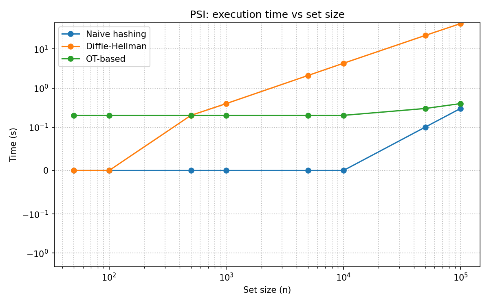
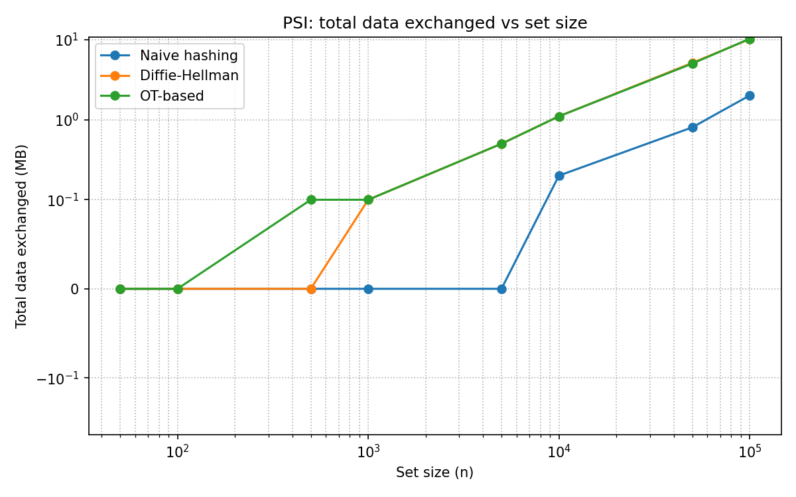

# Private Set Intersection — Protocols, Benchmarks and a Real-World Case Study

[](LICENSE)
[](report/main.pdf)


Two parties each hold a private set. They want to learn **only** which elements
they have in common — and nothing else about each other's data. That is
**Private Set Intersection (PSI)**, a practical instance of Secure Multiparty
Computation.

This repository studies four PSI protocols, measures what they actually cost on
the wire and on the CPU, verifies with a packet analyser that they leak what the
theory says they leak, and finally applies the strongest of them to a real
problem: finding the songs two people both like, without either revealing their
music library.

Coursework for *Privacy Enhancing Technologies* (Tecnologias de Reforço da
Privacidade), MSc in Information Security, Faculty of Sciences, University of
Porto. Full written report (in Portuguese): **[`report/main.pdf`](report/main.pdf)**.

---

## The four protocols

Implementations come from the [PSI suite](https://github.com/encryptogroup/PSI)
by the Cryptography and Privacy Engineering Group at TU Darmstadt.

| # | Protocol | Idea | What it leaks | Reference |
|---|----------|------|---------------|-----------|
| 0 | **Naive hashing** | Exchange truncated hashes of each element and intersect locally | Everything — hashes of low-entropy inputs are trivially brute-forced | — |
| 1 | **Server-aided** | An untrusted third party matches blinded elements for both sides | Nothing to the parties; requires the server not to collude | Kamara et al. |
| 2 | **Diffie–Hellman** | Both parties exponentiate each other's hashed elements with a secret key | Nothing beyond the intersection | Meadows |
| 3 | **OT-based** | Oblivious transfer extension + hashing to bins | Nothing beyond the intersection | Pinkas et al. |

The protocol number is the `-p` flag of the PSI binaries.

## Key findings

**Security is not free, but the price is not where you would guess.** The naive
protocol is the cheapest and the only insecure one — but the two secure
protocols trade off in *opposite* directions:

- **Diffie–Hellman** keeps communication low (~10 MB at n = 100 000) but spends
  a public-key exponentiation per element: **45 s at n = 100 000**, growing
  linearly and steeply.
- **OT-based** stays at **0.4 s for the same 100 000 elements** — its cost is a
  fixed base-OT setup, so the curve is nearly flat — but it pushes ~10 MB and
  grows faster in bandwidth.

The practical rule that falls out: **OT-based PSI for large sets or
CPU-constrained parties, Diffie–Hellman when bandwidth is the scarce resource.**

<p align="center">
  
  
</p>

**The leakage is observable.** Capturing the naive protocol in Wireshark shows
the 6-byte truncated SHA-256 digests travelling in the clear on port 7766;
`echo -n up202509273 | sha256sum | cut -c -12` reproduces the exact value seen in
the packet. Nothing else is exchanged — which is precisely why the protocol is
broken for any enumerable input domain.

---

## Repository structure

```
├── data/                            # The two app-list datasets used in the experiments
├── docs/
│   ├── assignment-brief.pdf         # Original assignment specification
│   └── papers/                      # Reference papers for the protocols
├── experiments/
│   ├── 01-protocol-experiments/     # Running all 4 protocols + traffic analysis
│   │   ├── inputs/                  # Inputs fed to the PSI binary
│   │   ├── captures/                # Wireshark captures (.pcapng) and packet dumps
│   │   └── outputs/                 # Computed intersections, per protocol
│   ├── 02-benchmarks/               # Scaling study: n from 50 to 100 000
│   │   ├── bench.sh                 # Measurement harness
│   │   ├── plot.py                  # Produces the two plots above
│   │   └── results.csv              # Raw measurements
│   └── 03-spotify-psi/              # Case study on real Spotify libraries
│       ├── extract_tracks.py        # CSV export -> track-ID list (with padding)
│       ├── exports/                 # Liked Songs CSV exports of both parties
│       ├── inputs/                  # Extracted track IDs
│       └── outputs/                 # PSI result + plaintext cross-check
└── report/                          # LaTeX sources and compiled report
```

---

## Experiment 1 — Running the protocols and watching the traffic

All four protocols were run on the same pair of app lists (36 and 34 entries) and
all four agreed on the same 5-element intersection:

```
com.whatsapp · org.meowcat.edxposed.manager · com.google.android.apps.maps
com.android.chrome · com.delaware.empark
```

Traffic captured for each run, same input, same result:

| Protocol | Packets | Bytes captured |
|---|---:|---:|
| Naive hashing (`-p 0`) | 31 | 4 016 |
| Server-aided (`-p 1`) | 32 | 4 768 |
| Diffie–Hellman (`-p 2`) | 30 | 7 084 |
| OT-based (`-p 3`) | 36 | 56 580 |

The OT-based protocol costs an order of magnitude more bandwidth at this scale —
its base-OT setup dominates when n is small, which is exactly the constant term
that makes it win at n = 100 000.

> **Implementation quirk found along the way:** the server-aided protocol
> requires both parties to submit sets of *equal* size. `AppList2.csv` (34 rows)
> was padded to 36 with filler entries; the padded inputs are kept in
> `experiments/01-protocol-experiments/inputs/`.

## Experiment 2 — Scaling

`bench.sh` runs both roles of `psi.exe` for protocols 0, 2 and 3 across
n ∈ {50, 100, 500, 1 000, 5 000, 10 000, 50 000, 100 000}, parsing the binary's
own timing and byte counters. Selected rows from [`results.csv`](experiments/02-benchmarks/results.csv):

| Protocol | n = 1 000 | n = 10 000 | n = 100 000 |
|---|---|---|---|
| Naive | 0.0 s · 0.0 MB | 0.0 s · 0.2 MB | 0.3 s · 2.0 MB |
| Diffie–Hellman | 0.4 s · 0.1 MB | 4.3 s · 1.1 MB | **44.6 s** · 10.1 MB |
| OT-based | 0.2 s · 0.1 MB | 0.2 s · 1.1 MB | **0.4 s** · 10.2 MB |

## Experiment 3 — Which songs do we both like?

A genuine two-party run with a real partner. Each side exported their Spotify
**Liked Songs** (579 and 601 tracks) and wanted the overlap without disclosing
the rest of their library.

```bash
cd experiments/03-spotify-psi
python3 extract_tracks.py --in exports/liked_songs_artur.csv --out inputs/artur_ids.txt --pad-to 601
python3 extract_tracks.py --in exports/liked_songs_tiago.csv --out inputs/tiago_ids.txt --pad-to 601

# terminal 1 (receiver)          # terminal 2 (sender)
./demo.exe -r 0 -p 3 -f artur_ids.txt
                                 ./demo.exe -r 1 -p 3 -f tiago_ids.txt
```

`extract_tracks.py` pulls the 22-character base62 ID out of each
`spotify:track:<id>` URI, de-duplicates, and pads the shorter list to a common
size with `FAKE`-prefixed identifiers that cannot collide with real base62 IDs —
working around the equal-size requirement without perturbing the result.

**Result: 2 tracks in common**, matching a plaintext `comm -12` cross-check:

| Track ID | Song |
|---|---|
| `4nKRZAONxGgcKCMin730Ai` | *33 Max Verstappen* — Carte Blanq, Nils Van Zandt, Maxx Power |
| `63T7DJ1AFDD6Bn8VzG6JE8` | *Paint It, Black* — The Rolling Stones |

Each side learned those two songs and nothing about the other ~577 and ~599.

---

## Reproducing

**Prerequisites** (Linux only — the PSI suite does not build elsewhere):

```bash
sudo apt install -y g++ make libgmp-dev libglib2.0-dev libssl-dev wireshark
git clone --recursive https://github.com/encryptogroup/PSI && cd PSI && make
```

**Run a protocol** — receiver first, in two terminals:

```bash
./demo.exe -r 0 -p <0|1|2|3> -f <file>
./demo.exe -r 1 -p <0|1|2|3> -f <file>
```

**Reproduce the benchmarks and plots:**

```bash
PSI_DIR=~/PSI experiments/02-benchmarks/bench.sh
python3 experiments/02-benchmarks/plot.py
```

**Rebuild the report** (requires XeLaTeX, uses `latexmk`):

```bash
cd report && latexmk
```

---

## References

1. B. Pinkas, T. Schneider, M. Zohner. *Scalable Private Set Intersection Based on OT Extension.* ACM TOPS, 2018. — [`docs/papers/2016-930.pdf`](docs/papers/2016-930.pdf)
2. S. Kamara, P. Mohassel, M. Raykova, S. Sadeghian. *Scaling Private Set Intersection to Billion-Element Sets.* — [`docs/papers/sapsi.pdf`](docs/papers/sapsi.pdf)
3. C. Meadows. *A More Efficient Cryptographic Matchmaking Protocol for Use in the Absence of a Continuously Available Third Party.* IEEE S&P, 1986. — [`docs/papers/`](docs/papers/)
4. [encryptogroup/PSI](https://github.com/encryptogroup/PSI) — the protocol implementations benchmarked here.

## Authors

Artur Correia · Tiago Pinheiro — MSc Information Security, FCUP.

Licensed under the [MIT License](LICENSE).
